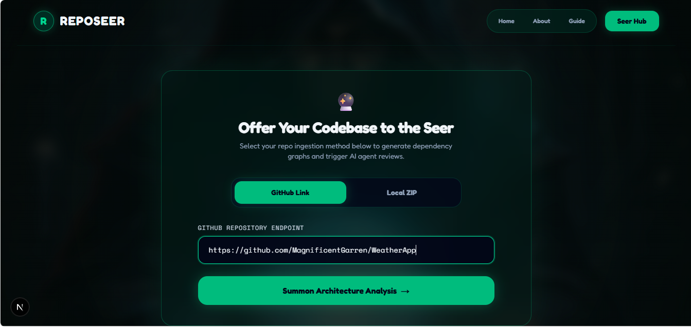
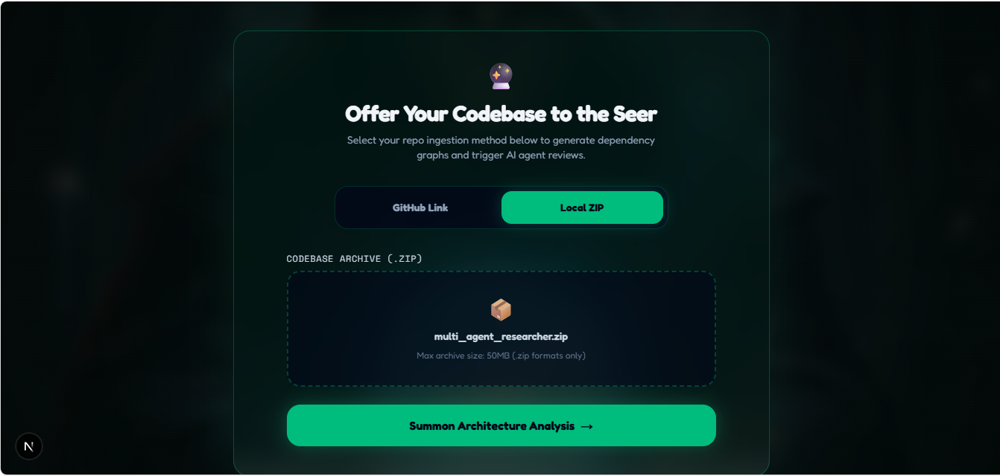
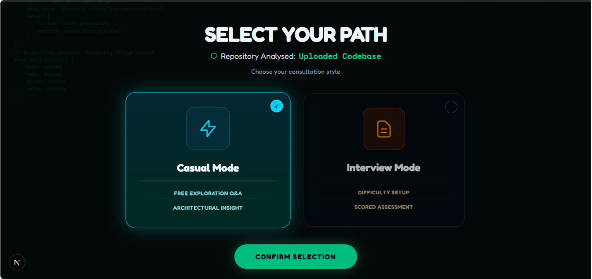
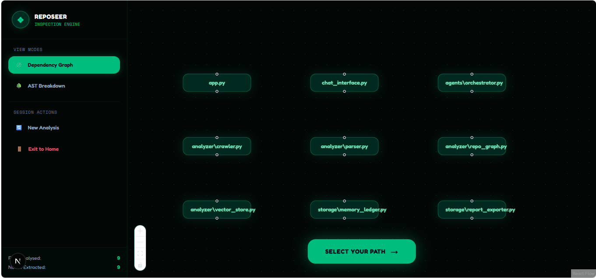
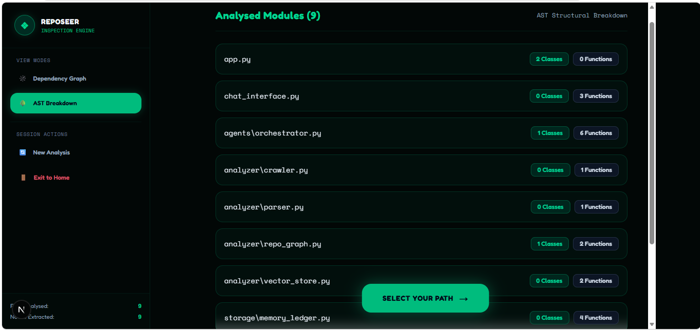
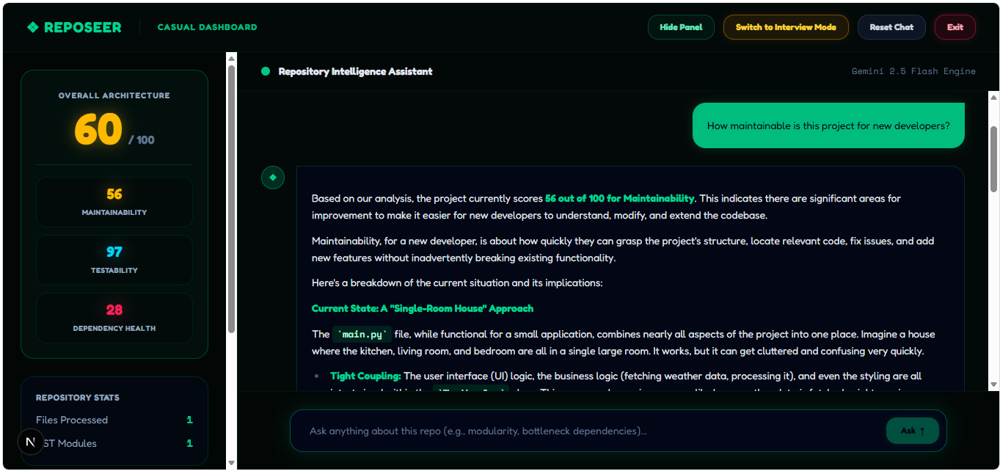
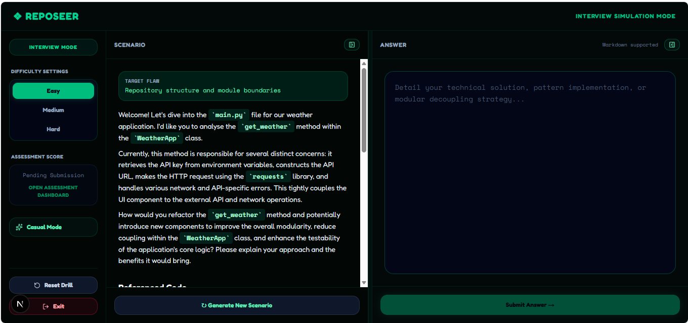
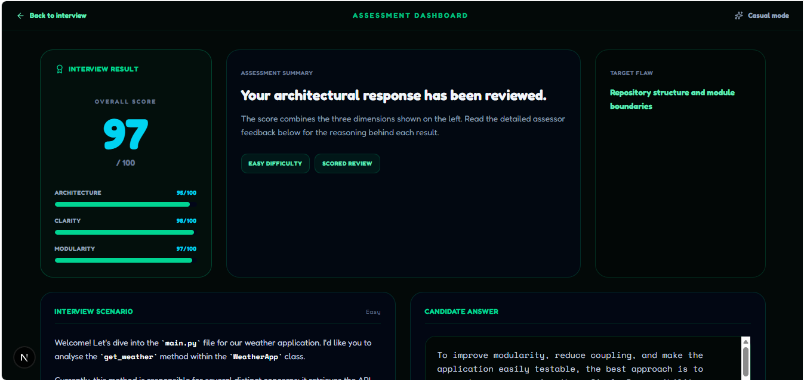
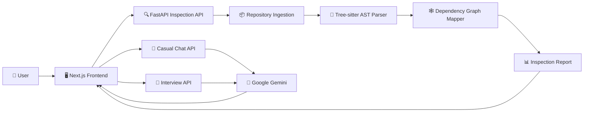

# 🔭 Reposeer

### AI-Powered Repository Intelligence & Architectural Interview Simulator

> **Don't just read the codebase. Understand it. Challenge it. Defend it.**

Reposeer is an AI-assisted developer tool designed to turn unfamiliar Python repositories into something you can actually **understand, explore, and reason about**.

It combines **static code analysis, AST parsing, dependency mapping, repository inspection, AI-powered conversation, and architectural interview simulation** into one platform.

Whether you're trying to understand a new codebase, investigate its architecture, or test whether you can explain your own engineering decisions under pressure — **Reposeer is built to make you think like a technical lead.** 🧠

---

## 🚀 What is Reposeer?

Walking into an unfamiliar repository can feel like this:

```text
src/
├── utils/
├── services/
├── core/
├── manager/
├── helper_final.py
├── helper_final_v2.py
└── somehow_this_works.py
```

You open one file.

Then another.

Then another.

Three hours later, you're still trying to figure out who calls what.

**Reposeer exists to fix that.**

It analyses a Python repository and builds a structured understanding of its:

* 🧩 Modules and dependencies
* 🌳 Abstract Syntax Tree (AST) structure
* 🏗️ Classes and functions
* 🔗 Import relationships
* 🕸️ Dependency graphs
* ⚠️ Architectural risks
* 💬 AI-assisted explanations
* 🎯 Interview scenarios
* 📊 Architectural evaluation

Instead of simply asking:

> *"What does this code do?"*

Reposeer helps you ask:

> *"Why is it designed this way, what could go wrong, and how would I explain it in an architecture interview?"*

---

# ✨ Features

| Feature                        | Description                                              |
| ------------------------------ | -------------------------------------------------------- |
| 🐙 **GitHub Analysis**         | Analyse public GitHub repositories                       |
| 📦 **ZIP Uploads**             | Upload local Python projects for inspection              |
| 🌳 **AST Analysis**            | Inspect classes, functions and imports                   |
| 🕸️ **Dependency Graphs**      | Visualise relationships between modules                  |
| 🤖 **AI Repository Chat**      | Ask questions about the analysed codebase                |
| 🎯 **Interview Mode**          | Practise repository-aware architecture interviews        |
| ⚡ **Live Analysis**            | Stream analysis progress to the frontend                 |
| 📊 **Evaluation Metrics**      | Receive structured feedback on interview responses       |
| 🧠 **Architectural Reasoning** | Explore maintainability, modularity and design decisions |

---

# 🖥️ Product Walkthrough

## 01 — 🔌 Connect a Repository

Start by providing a **public GitHub repository URL** or uploading a local ZIP archive.

Reposeer takes the repository and begins building an understanding of the codebase.



---

## 02 — 📦 Upload a Local Project

Working with a local Python project?

Upload it as a ZIP archive.

The current upload flow requires the archive to contain Python source code and limits uploads to **50 MB**.



---

## 03 — 🧭 Choose Your Mode

Once the repository has been analysed, you can choose how you want to interact with it.

### 💬 Casual Mode

Explore the repository conversationally.

Ask questions about:

* Architecture
* Dependencies
* Maintainability
* Modularity
* Potential risks
* Code organisation

### 🎯 Interview Mode

Stop asking questions.

Start answering them.

Interview Mode generates repository-aware architectural scenarios and challenges you to explain your engineering decisions.



---

# 🕸️ Repository Intelligence

## Dependency Graph

Reposeer transforms repository relationships into a visual dependency graph.

You can inspect:

* Module relationships
* Import paths
* Dependency clusters
* Potential circular dependencies
* Structural relationships within the repository



---

## 🌳 AST Breakdown

Reposeer uses **Tree-sitter** to inspect Python source structure.

Instead of treating source code as a wall of text, the system identifies important structural elements such as:

```text
Python File
   │
   ├── Imports
   │
   ├── Classes
   │    ├── Methods
   │    └── Attributes
   │
   └── Functions
```

This provides the structural foundation for the repository analysis.



---

# 🤖 Meet the Seer

Once the repository has been analysed, the AI can use the generated inspection information as context.

Ask questions like:

> "Where is authentication handled?"

> "What are the major dependencies in this project?"

> "Where could this architecture become difficult to maintain?"

> "How would you restructure this module?"

> "What would you ask a developer about this codebase in an interview?"



The goal isn't simply to generate answers.

It's to help developers **understand the reasoning behind the code.**

---

# 🎯 Architecture Interview Mode

This is where things get uncomfortable.

In a good way.

Interview Mode generates architectural scenarios based on the analysed repository.

Choose your difficulty:

```text
🟢 EASY
Understand the architecture.

🟡 MEDIUM
Explain the architecture and identify trade-offs.

🔴 HARD
Defend your architectural decisions.
```

You are given a scenario and expected to provide an architectural response.



---

# 🧠 Architectural Evaluation

After submitting your response, Reposeer evaluates the answer and provides structured feedback.

The evaluation focuses on areas such as:

* 🏗️ Architecture
* 💬 Clarity
* 🧩 Modularity
* 🔍 Technical reasoning
* 📚 Understanding of the repository

The purpose isn't just to produce a number.

The goal is to answer:

> **"Why did I receive this evaluation?"**



---

# 🏗️ Architecture



### 🔄 Analysis Pipeline

```text
Repository
     │
     ▼
📥 Ingestion
     │
     ▼
🌳 AST Parsing
     │
     ▼
🔗 Dependency Mapping
     │
     ▼
📊 Structural Analysis
     │
     ▼
🧠 Repository Context
     │
     ├───────────────┐
     ▼               ▼
💬 Casual Mode   🎯 Interview Mode
     │               │
     └───────┬───────┘
             ▼
        🤖 AI Feedback
```

---

# 🛠️ Technology Stack

## 🎨 Frontend

* **Next.js 16**
* **React 19**
* **TypeScript**
* **Tailwind CSS**
* **React Flow**
* **React Markdown**
* **Lucide React**

## ⚙️ Backend

* **Python 3.11+**
* **FastAPI**
* **Uvicorn**
* **Tree-sitter**
* **Tree-sitter Python**
* **GitPython**
* **NetworkX**
* **Pydantic**
* **Google Gemini**

## 🗄️ Infrastructure

* **PostgreSQL**
* **Redis**
* **Docker Compose**

---

# 📁 Project Structure

```text
reposeer/
│
├── backend/
│   ├── app/
│   │   ├── api/
│   │   │   ├── chat.py
│   │   │   ├── inspect.py
│   │   │   └── interview.py
│   │   │
│   │   ├── models/
│   │   │
│   │   └── services/
│   │       ├── ast_parser.py
│   │       ├── graph_mapper.py
│   │       └── ingestion.py
│   │
│   ├── Dockerfile
│   ├── pyproject.toml
│   └── requirements.txt
│
├── frontend/
│   ├── public/
│   │   └── guide/
│   │
│   ├── src/
│   │   ├── app/
│   │   ├── components/
│   │   └── lib/
│   │
│   ├── Dockerfile
│   └── package.json
│
├── docker-compose.yml
└── README.md
```

---

# ⚡ Getting Started

## 📋 Requirements

Before running Reposeer locally, make sure you have:

* **Node.js 20+**
* **npm 10+**
* **Python 3.11+**
* **Git**
* **Docker Desktop** *(recommended)*
* A **Google Gemini API key** for AI functionality

---

# 🔐 Environment Variables

Create a `.env` file in the repository root:

```env
GEMINI_API_KEY=your_gemini_api_key
```

For local frontend development, you can optionally create:

```text
frontend/.env.local
```

```env
NEXT_PUBLIC_API_URL=http://localhost:8000
```

⚠️ **Never commit API keys, credentials, or other secrets to GitHub.**

---

# 🐳 Run with Docker

Docker Compose can start the:

* 🖥️ Frontend
* ⚙️ Backend
* 🐘 PostgreSQL
* 🔴 Redis

Run:

```bash
docker compose up --build
```

Then open:

```text
http://localhost:3001
```

### Backend

```text
http://localhost:8000
```

### FastAPI Documentation

```text
http://localhost:8000/docs
```

### Stop the application

```bash
docker compose down
```

### Remove persistent volumes

```bash
docker compose down -v
```

---

# 💻 Run Locally

## ⚙️ Backend

From the repository root:

```bash
cd backend
```

Create a virtual environment:

```bash
python -m venv .venv
```

### Windows

```powershell
.\.venv\Scripts\Activate.ps1
```

### macOS / Linux

```bash
source .venv/bin/activate
```

Install dependencies:

```bash
pip install -r requirements.txt
```

Start FastAPI:

```bash
uvicorn app.main:app --reload --port 8000
```

---

## 🎨 Frontend

Open another terminal:

```bash
cd frontend
```

Install dependencies:

```bash
npm install
```

Start the development server:

```bash
npm run dev
```

Open:

```text
http://localhost:3000
```

---

# 🔌 API

| Method | Endpoint                           | Purpose                             |
| ------ | ---------------------------------- | ----------------------------------- |
| `GET`  | `/`                                | Backend health response             |
| `POST` | `/api/inspect/github`              | Analyse a public GitHub repository  |
| `POST` | `/api/inspect/upload`              | Analyse an uploaded ZIP archive     |
| `GET`  | `/api/inspect/stream/{job_id}`     | Stream inspection progress          |
| `POST` | `/api/seer/chat`                   | AI-assisted repository conversation |
| `POST` | `/api/interview/generate-question` | Generate an interview scenario      |
| `POST` | `/api/interview/evaluate`          | Evaluate an interview response      |

### Example

Start a repository inspection:

```bash
curl -X POST http://localhost:8000/api/inspect/github \
  -H "Content-Type: application/json" \
  -d "{\"repo_url\":\"https://github.com/owner/repository\"}"
```

The API returns a job identifier:

```json
{
  "job_id": "job-identifier",
  "status": "processing"
}
```

Use the identifier to stream analysis progress:

```bash
curl http://localhost:8000/api/inspect/stream/job-identifier
```

---

# 🔬 How Analysis Works

Reposeer's inspection pipeline follows these stages:

```text
1. 🔗 Validate repository source
          ↓
2. 📥 Clone / extract repository
          ↓
3. 🐍 Collect Python source files
          ↓
4. 🌳 Parse source using Tree-sitter
          ↓
5. 🕸️ Build dependency graph
          ↓
6. 📊 Calculate structural metrics
          ↓
7. 📋 Generate inspection report
          ↓
8. 🧠 Provide context to AI features
```

This allows the AI-powered features to work with information derived from the repository rather than relying purely on a generic conversation.

---

# 🧪 Testing

### Backend Tests

From the `backend` directory:

```bash
pytest
```

### Frontend Linting

```bash
cd frontend
npm run lint
```

### Production Build

```bash
npm run build
```

---

# 🔒 Security

Some important considerations when running Reposeer:

* 🔑 Never commit `.env` files or API keys.
* 📦 ZIP uploads must contain Python source files.
* 📏 ZIP uploads are limited to 50 MB.
* 🧠 Analysis jobs are currently stored temporarily in memory.
* 🐙 GitHub ingestion currently supports public repositories.
* 🌐 Review CORS configuration before public deployment.
* 🔐 Authentication and rate limiting should be added before exposing the API to untrusted users.

---

# 🚧 Current Limitations

Reposeer is actively evolving.

Current limitations include:

* GitHub analysis currently targets public repositories.
* Static analysis primarily focuses on Python.
* Analysis job state is held in memory.
* AI functionality requires a configured Gemini API key.
* Production deployment configuration is not currently included.

---

# 🗺️ Roadmap

Reposeer is being built toward a more complete repository intelligence platform.

### 🔭 Planned

* [ ] 🔐 Private GitHub repository support
* [ ] 💾 Persistent analysis history
* [ ] 🌎 Additional programming language parsers
* [ ] 👤 Authentication and workspace support
* [ ] ⚡ Background task queue integration
* [ ] 📊 More detailed architecture metrics
* [ ] 📄 Exportable inspection reports
* [ ] ☁️ Production deployment templates

---

# 📜 License

This project is currently **unlicensed**.

A license should be added before distributing the project or accepting external contributions.

---

# 🙏 Acknowledgements

Reposeer would not exist without the excellent tools and technologies it builds upon.

* [Next.js](https://nextjs.org/)
* [FastAPI](https://fastapi.tiangolo.com/)
* [Tree-sitter](https://tree-sitter.github.io/tree-sitter/)
* [React Flow](https://reactflow.dev/)
* [NetworkX](https://networkx.org/)
* [Google Gemini](https://ai.google.dev/)

---

# 🧠 The Philosophy

Reposeer is built around a simple idea:

> **Understanding a codebase is an engineering skill.**

Reading code is easy.

Understanding why it exists is harder.

Explaining its architecture is harder still.

And defending that architecture when someone asks:

> *"Okay... but what happens when this system has 10 million users?"*

...is where things get interesting. 😅

Reposeer is designed to help developers get better at that last part.

---

# 🫡 Final Words

Built with **Python, TypeScript, FastAPI, Next.js, Tree-sitter, Gemini, questionable amounts of caffeine, and an unhealthy willingness to stare at dependency graphs.**

If Reposeer tells you that your architecture has a circular dependency...

**don't shoot the messenger.**

The messenger is just very good at finding your problems. 🔭

---

<p align="center">

### 🔭 Reposeer

**Inspect. Understand. Explain. Defend.**

</p>
