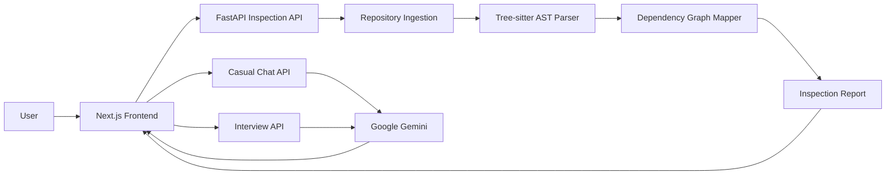

I’ll inspect the existing README, the guide assets, and the project’s current routes/config so the GitHub-ready document reflects the app accurately and uses real images from the repository.

Read 

Read 

Read 

Read 

Read 

The current README is still the stock Next.js template, while the app already has a polished eight-step guide with screenshots. I’m checking the backend entry points and environment names now so the setup, architecture, and API sections are accurate rather than generic.

Read 

Read 

Read 

Read 

Read 

Read 

Read 

The project is a Next.js 16 frontend paired with a FastAPI service, PostgreSQL, Redis, Tree-sitter analysis, and Gemini-backed chat/interview flows. The README will be root-oriented, so screenshot links should use `frontend/public/guide/...` paths; I’m doing one final pass over endpoint behavior and test commands before drafting it.

Searched for files matching `**/.env*`, no matches

Searched for files matching `**/README.md`, 1 match

Read 

Read 

Read 

Read 

Copy this into a root-level `README.md`:

```markdown
# Reposeer

> AI-assisted repository inspection for understanding Python codebases, dependency structure, and architectural health.

Reposeer analyses Python repositories and turns unfamiliar source code into an interactive architectural report. Upload a local ZIP archive or provide a public GitHub repository URL to explore dependency graphs, AST structure, codebase risks, and AI-generated recommendations.


## Features

- Analyse public GitHub repositories
- Upload local Python projects as ZIP archives
- Parse Python source using Tree-sitter
- Generate dependency graphs between modules
- Inspect classes, functions, and imports through AST analysis
- Explore architectural insights with AI-assisted chat
- Practise repository-aware technical interviews
- Receive scored feedback on architecture, clarity, and modularity
- Stream analysis progress to the frontend using Server-Sent Events

## Product Walkthrough

### Connect a Repository

Enter a public GitHub repository URL or upload a local ZIP archive.


### Upload a Local Project

Private or local repositories can be uploaded as ZIP files. Archives must contain at least one Python file and be smaller than 50 MB.


### Choose an Analysis Mode

After inspection, choose between Casual Mode for exploration and Interview Mode for architectural practice.


### Explore the Dependency Graph

Inspect module relationships, import paths, dependency clusters, and potential circular dependencies.


### Inspect the AST Breakdown

Review the classes, functions, and imports detected in each Python file.


### Ask the Seer

Use Casual Mode to ask questions about architecture, maintainability, modularity, risks, and possible improvements.


### Practise Architecture Interviews

Interview Mode generates repository-aware questions at Easy, Medium, or Hard difficulty levels.


### Review Your Evaluation

Submit an answer and receive feedback across architecture, clarity, and modularity.


## Architecture



## Technology Stack

### Frontend

- Next.js 16
- React 19
- TypeScript
- Tailwind CSS
- React Flow
- React Markdown
- Lucide React

### Backend

- Python 3.11+
- FastAPI
- Uvicorn
- Tree-sitter
- Tree-sitter Python
- GitPython
- NetworkX
- Pydantic
- Google Gemini

### Infrastructure

- PostgreSQL
- Redis
- Docker Compose

## Project Structure

```text
reposeer/
├── backend/
│   ├── app/
│   │   ├── api/
│   │   │   ├── `chat.py`
│   │   │   ├── `inspect.py`
│   │   │   └── `interview.py`
│   │   ├── models/
│   │   └── services/
│   │       ├── ast_parser.py
│   │       ├── graph_mapper.py
│   │       └── ingestion.py
│   ├── Dockerfile
│   ├── `pyproject.toml`
│   └── `requirements.txt`
├── frontend/
│   ├── public/
│   │   └── guide/
│   ├── src/
│   │   ├── app/
│   │   ├── components/
│   │   └── lib/
│   ├── Dockerfile
│   └── `package.json`
├── `docker-compose.yml`
└── `README.md`
```

## Requirements

Install the following before running Reposeer locally:

- Node.js 20+
- npm 10+
- Python 3.11+
- Git
- Docker Desktop, recommended
- A Google Gemini API key for AI features

## Environment Variables

Create a `.env` file in the repository root:

```env
GEMINI_API_KEY=your_gemini_api_key
```

For local frontend development, optionally create `frontend/.env.local`:

```env
NEXT_PUBLIC_API_URL=http://localhost:8000
```

Never commit API keys or other secrets to GitHub.

## Running with Docker Compose

Docker Compose starts the frontend, backend, PostgreSQL, and Redis services.

```bash
docker compose up --build
```

Open the application:

```text
http://localhost:3001
```

The backend API is available at:

```text
http://localhost:8000
```

FastAPI interactive documentation is available at:

```text
http://localhost:8000/docs
```

Stop the services with:

```bash
docker compose down
```

To remove persistent database and Redis volumes:

```bash
docker compose down -v
```

## Running Locally

### Start the Backend

From the repository root:

```bash
cd backend

python -m venv .venv
```

Activate the virtual environment on Windows:

```powershell
.\.venv\Scripts\Activate.ps1
```

Activate it on macOS or Linux:

```bash
source .venv/bin/activate
```

Install dependencies:

```bash
pip install -r `requirements.txt`
```

Start FastAPI:

```bash
uvicorn app.main:app --reload --port 8000
```

### Start the Frontend

Open a second terminal:

```bash
cd frontend
npm install
npm run dev
```

Open:

```text
http://localhost:3000
```

## API Endpoints

| Method | Endpoint | Description |
| --- | --- | --- |
| `GET` | `/` | Backend health response |
| `POST` | `/api/inspect/github` | Start analysis for a public GitHub repository |
| `POST` | `/api/inspect/upload` | Start analysis for a ZIP archive |
| `GET` | `/api/inspect/stream/{job_id}` | Stream inspection progress and results |
| `POST` | `/api/seer/chat` | Stream AI-assisted repository explanations |
| `POST` | `/api/interview/generate-question` | Generate a repository-aware interview question |
| `POST` | `/api/interview/evaluate` | Evaluate a candidate response |

Example GitHub inspection request:

```bash
curl -X POST http://localhost:8000/api/inspect/github \
  -H "Content-Type: application/json" \
  -d "{\"repo_url\":\"https://github.com/owner/repository\"}"
```

The response returns a job ID:

```json
{
  "job_id": "job-identifier",
  "status": "processing"
}
```

Use the job ID to stream progress:

```bash
curl http://localhost:8000/api/inspect/stream/job-identifier
```

## Analysis Pipeline

1. Validate the GitHub URL or uploaded ZIP archive.
2. Clone or extract the repository.
3. Collect Python source files.
4. Parse classes, functions, and imports with Tree-sitter.
5. Build a dependency graph.
6. Calculate structural analysis metrics.
7. Return the report to the frontend.
8. Use the report as context for Casual Mode and Interview Mode.

## Testing

Run the backend tests from the `backend` directory:

```bash
pytest
```

Run the frontend lint checks:

```bash
cd frontend
npm run lint
```

Build the frontend for production:

```bash
npm run build
```

## Security Notes

- Do not commit `.env` files or API keys.
- ZIP uploads must contain Python source files.
- ZIP uploads are limited to 50 MB.
- Analysis jobs are stored temporarily in memory.
- Only public GitHub repositories are supported by the GitHub ingestion flow.
- Review and restrict CORS settings before deploying publicly.
- Add authentication and rate limiting before exposing the API to untrusted users.

## Current Limitations

- GitHub analysis currently targets public repositories.
- The primary static analysis pipeline focuses on Python files.
- Analysis job state is held in memory.
- AI responses require a configured Gemini API key.
- Production deployment configuration is not included.

## Roadmap

- Private GitHub repository support
- Persistent analysis history
- Additional programming language parsers
- Authentication and workspace support
- Background task queue integration
- More detailed architecture metrics
- Exportable inspection reports
- Production deployment templates

## Contributing

Contributions are welcome.

1. Fork the repository.
2. Create a feature branch:

   ```bash
   git checkout -b feature/your-feature
   ```

3. Make and test your changes.
4. Commit your work:

   ```bash
   git commit -m "Add your feature"
   ```

5. Push the branch:

   ```bash
   git push origin feature/your-feature
   ```

6. Open a pull request.

Please keep pull requests focused, document behaviour changes, and include tests where appropriate.

## License

This project is currently unlicensed. Add a license file before distributing or accepting external contributions.

## Acknowledgements

- [Next.js](https://nextjs.org/)
- [FastAPI](https://fastapi.tiangolo.com/)
- [Tree-sitter](https://tree-sitter.github.io/tree-sitter/)
- [React Flow](https://reactflow.dev/)
- [NetworkX](https://networkx.org/)
- [Google Gemini](https://ai.google.dev/)
```
